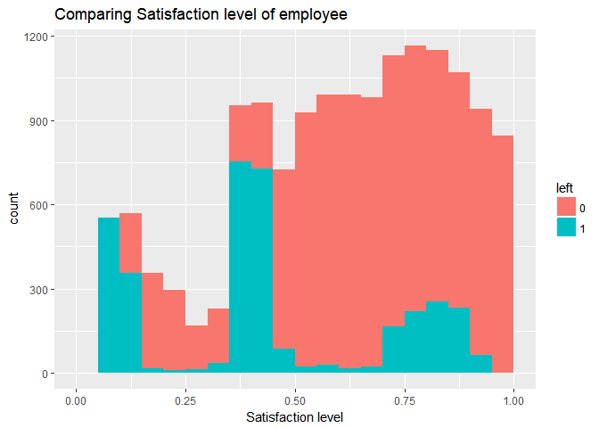
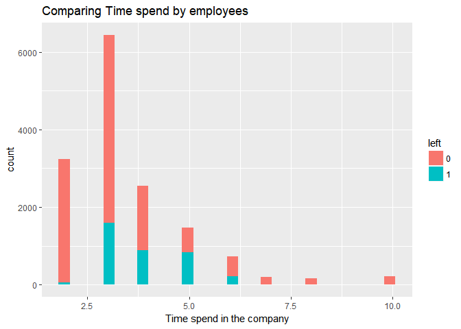
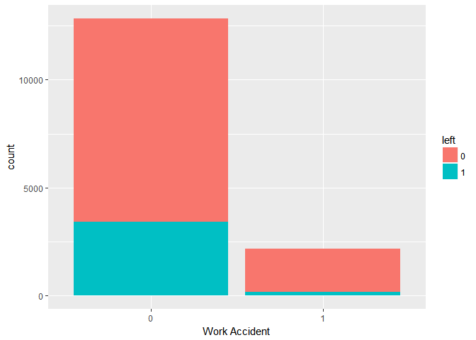
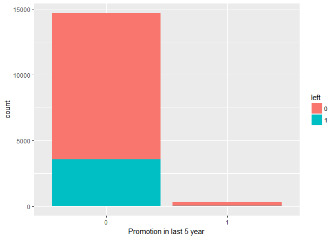
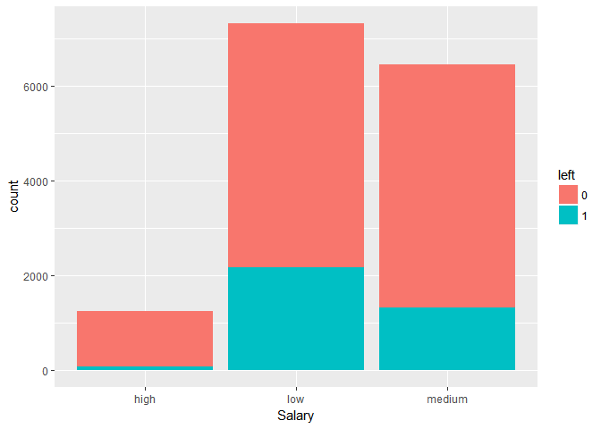
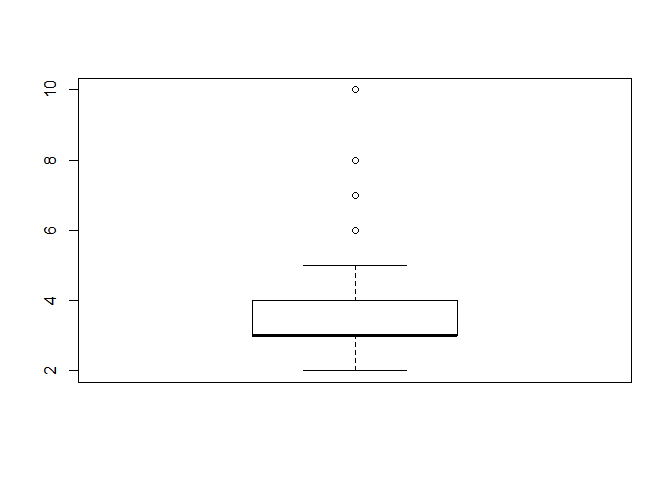
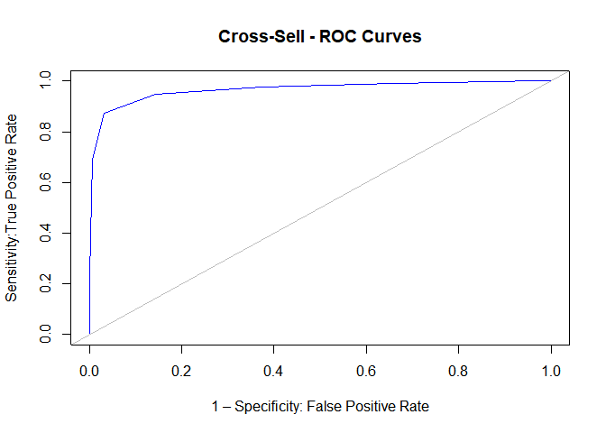

HR Analytics
============

The data set
------------

    hrdata<-read.csv("HR_comma_sep.csv",header=T)
    head(hrdata)

    ##   satisfaction_level last_evaluation number_project average_montly_hours
    ## 1               0.38            0.53              2                  157
    ## 2               0.80            0.86              5                  262
    ## 3               0.11            0.88              7                  272
    ## 4               0.72            0.87              5                  223
    ## 5               0.37            0.52              2                  159
    ## 6               0.41            0.50              2                  153
    ##   time_spend_company Work_accident left promotion_last_5years sales salary
    ## 1                  3             0    1                     0 sales    low
    ## 2                  6             0    1                     0 sales medium
    ## 3                  4             0    1                     0 sales medium
    ## 4                  5             0    1                     0 sales    low
    ## 5                  3             0    1                     0 sales    low
    ## 6                  3             0    1                     0 sales    low

Data exploration
----------------

### Summary

    summary(hrdata)

    ##  satisfaction_level last_evaluation  number_project  average_montly_hours
    ##  Min.   :0.0900     Min.   :0.3600   Min.   :2.000   Min.   : 96.0       
    ##  1st Qu.:0.4400     1st Qu.:0.5600   1st Qu.:3.000   1st Qu.:156.0       
    ##  Median :0.6400     Median :0.7200   Median :4.000   Median :200.0       
    ##  Mean   :0.6128     Mean   :0.7161   Mean   :3.803   Mean   :201.1       
    ##  3rd Qu.:0.8200     3rd Qu.:0.8700   3rd Qu.:5.000   3rd Qu.:245.0       
    ##  Max.   :1.0000     Max.   :1.0000   Max.   :7.000   Max.   :310.0       
    ##                                                                          
    ##  time_spend_company Work_accident         left       
    ##  Min.   : 2.000     Min.   :0.0000   Min.   :0.0000  
    ##  1st Qu.: 3.000     1st Qu.:0.0000   1st Qu.:0.0000  
    ##  Median : 3.000     Median :0.0000   Median :0.0000  
    ##  Mean   : 3.498     Mean   :0.1446   Mean   :0.2381  
    ##  3rd Qu.: 4.000     3rd Qu.:0.0000   3rd Qu.:0.0000  
    ##  Max.   :10.000     Max.   :1.0000   Max.   :1.0000  
    ##                                                      
    ##  promotion_last_5years         sales         salary    
    ##  Min.   :0.00000       sales      :4140   high  :1237  
    ##  1st Qu.:0.00000       technical  :2720   low   :7316  
    ##  Median :0.00000       support    :2229   medium:6446  
    ##  Mean   :0.02127       IT         :1227                
    ##  3rd Qu.:0.00000       product_mng: 902                
    ##  Max.   :1.00000       marketing  : 858                
    ##                        (Other)    :2923

This table describe the characteristics of each features of our ABT. We
can see different statistical measures of central tendency and
variation. For example we can see that our attrition rate is equal to
24%, the satisfaction level is around 62% and the performance average is
around 71%. We see that on average people work on 3 to 4 projects a year
and about 200 hours per months.

### Visualizations

Understanding the dependancy of different factors on letting the job
left and getting the intution ou of it by simple exploratory data
analysis.

    library(ggplot2)

    ## Warning: package 'ggplot2' was built under R version 3.4.2

    dataleft<-hrdata[hrdata$left==1,c(1,7)]
    datanotleft<-hrdata[hrdata$left==0,c(1,7)]
    finaldata<-rbind(dataleft,datanotleft)
    finaldata$left<-as.factor(finaldata$left)
    ggplot(finaldata,aes(finaldata$satisfaction_level,fill=finaldata$left))+geom_histogram(breaks=seq(0,1,.05))+labs(title="Comparing Satisfaction level of employee",x="Satisfaction level",fill= "left")

The results follow our intitution \* Most of the employee who left have
satisfaction level below 0.5 \* Employee who are still there ,most of
them have satisfaction level above 0.5 \* But uas expected some employee
left though having high satisfaction level. Why? we will be answering
this question forwardly.

Another important visualiation is to understand how time spend in the
company plots with left.

    dataleft1<-hrdata[hrdata$left==1,c(5,7)]
    datanotleft1<-hrdata[hrdata$left==0,c(5,7)]
    finaldata1<-rbind(dataleft1,datanotleft1)
    finaldata1$left<-as.factor(finaldata1$left)
    ggplot(finaldata1,aes(finaldata1$time_spend_company,fill=finaldata1$left))+geom_histogram()+labs(title="Comparing Time spend by employees",x="Time spend in the company",fill= "left")

    ## `stat_bin()` using `bins = 30`. Pick better value with `binwidth`.

Importants points to carved out are-

-   Employees who have spent less than 2 years are still there in
    the company.
-   Employess who have spent more than 6.5 yesr are still there in
    the comaany.
-   Employess mostly left betwen 3 and 6 years as there tenure in
    the company.

Unexpected result which came out of the analysis is the dependancy on
the Work accident

    table(hrdata$Work_accident,hrdata$left)

    ##    
    ##        0    1
    ##   0 9428 3402
    ##   1 2000  169

    hrdata$Work_accident<-as.factor(hrdata$Work_accident)
    hrdata$left<-as.factor(hrdata$left)
    ggplot(hrdata,aes(hrdata$Work_accident,fill=hrdata$left))+geom_bar()+labs(x="Work Accident",fill="left")

-   Unexpectedly greater percentage of employee who don't encountered
    any work accident left the job((26.52%)) then those
    who encountered(7.79%)

<!-- -->

    table(hrdata$promotion_last_5years,hrdata$left)

    ##    
    ##         0     1
    ##   0 11128  3552
    ##   1   300    19

    hrdata$promotion_last_5years<-as.factor(hrdata$promotion_last_5years)
    hrdata$left<-as.factor(hrdata$left)
    ggplot(hrdata,aes(hrdata$promotion_last_5years,fill=hrdata$left))+geom_bar()+labs(x="Promotion in last 5 year",fill="left")

-   As expected greater percentageof employee who don't promoted in last
    5 years left (24.19%) the those who got promoted(5.96%)

<!-- -->

    hrdata$salary<-as.factor(hrdata$salary)
    ggplot(hrdata,aes(hrdata$salary,fill=hrdata$left))+geom_bar()+labs(x="Salary",fill="left")

-   As expected more precentage of employee having low salary left the
    job then those having high Salary.

Applying Logistic regression to predict the employee which will leave the Company
---------------------------------------------------------------------------------

### Building Foundations

    apply(hrdata, 2, function(x) any(is.na(x)))

    ##    satisfaction_level       last_evaluation        number_project 
    ##                 FALSE                 FALSE                 FALSE 
    ##  average_montly_hours    time_spend_company         Work_accident 
    ##                 FALSE                 FALSE                 FALSE 
    ##                  left promotion_last_5years                 sales 
    ##                 FALSE                 FALSE                 FALSE 
    ##                salary 
    ##                 FALSE

\*Since there is no missing value in our data set hence we don't need
any missing value treatmment.

    boxplot(hrdata$time_spend_company)

-   Since we have got some outliers in the "time\_spend\_company" we
    need to treat these outliers For values that lie outside the
    1.5 \* IQR limits, we could cap it by replacing those observations
    outside the lower limit with the value of 5th %ile and those that
    lie above the upper limit, with the value of 95th %ile. Below is a
    sample code that achieves this.

<!-- -->

    x <- hrdata$time_spend_company
    qnt <- quantile(x, probs=c(.25, .75), na.rm = T)
    caps <- quantile(x, probs=c(.05, .95), na.rm = T)
    H <- 1.5 * IQR(x, na.rm = T)
    x[x < (qnt[1] - H)] <- caps[1]
    x[x > (qnt[2] + H)] <- caps[2]

-   Attaching this new vector to our orignal data frame.

<!-- -->

    hrdata<-cbind(hrdata,x)

### Starting with the cross validation

cross validation helps to test our model on unseen data and also helpsto
learn regularization parameter. parameter.

    library("caret")

    ## Warning: package 'caret' was built under R version 3.4.2

    ## Loading required package: lattice

    tr<-trainControl(method="cv",number = 10,summaryFunction = twoClassSummary,classProbs = T)

-   We are going for 10 fold cross validation. \*Since we have "left"
    varaible is skewed because we have much more "0" then "1". ROC will
    be effective parameter in validating the model.

### Training the model

    levels(hrdata$left)<-c("no","yes")
    logitmodel<- train(left~.-time_spend_company, data=hrdata,trControl=tr,  method="LogitBoost",metric="ROC")

    ## Warning: package 'caTools' was built under R version 3.4.1

    logitmodel

    ## Boosted Logistic Regression 
    ## 
    ## 14999 samples
    ##    10 predictor
    ##     2 classes: 'no', 'yes' 
    ## 
    ## No pre-processing
    ## Resampling: Cross-Validated (10 fold) 
    ## Summary of sample sizes: 13499, 13499, 13499, 13499, 13499, 13498, ... 
    ## Resampling results across tuning parameters:
    ## 
    ##   nIter  ROC        Sens       Spec     
    ##   11     0.9367630  0.9531844  0.8124118
    ##   21     0.9628161  0.9803121  0.8373011
    ##   31     0.9658612  0.9684979  0.8725834
    ## 
    ## ROC was used to select the optimal model using  the largest value.
    ## The final value used for the model was nIter = 31.

    logitmodel$resample

    ##          ROC      Sens      Spec Resample
    ## 1  0.9645853 0.9676290 0.8767507   Fold02
    ## 2  0.9611323 0.9790026 0.8515406   Fold01
    ## 3  0.9598849 0.9807524 0.8459384   Fold03
    ## 4  0.9696354 0.9746282 0.8770950   Fold06
    ## 5  0.9731308 0.9641295 0.8963585   Fold05
    ## 6  0.9667431 0.9562555 0.8795518   Fold04
    ## 7  0.9685873 0.9615048 0.8823529   Fold07
    ## 8  0.9644341 0.9640981 0.8963585   Fold10
    ## 9  0.9660851 0.9702537 0.8571429   Fold09
    ## 10 0.9643936 0.9667250 0.8627451   Fold08

-   High value of ROC justifies the high accuracy of the model.
-   Since for different folds ROC does not varry much henec there is no
    overfiiting of the model.
-   Unknown Parameter was set to give the maximum value of the ROC.
-   model with unknown parameter 31 was chosen to give ROC .96
    Sensitivity .96 and Specificity to be .87.

### Predicting the probality of leaving

     predictions<- predict(logitmodel,hrdata,type = "prob")
    head(predictions)

    ##            no       yes
    ## 1 0.047425873 0.9525741
    ## 2 0.731058579 0.2689414
    ## 3 0.006692851 0.9933071
    ## 4 0.268941421 0.7310586
    ## 5 0.047425873 0.9525741
    ## 6 0.047425873 0.9525741

-   Generating the Confusion Matrix and ROCR curve.

<!-- -->

    predictions1<- predict(logitmodel,hrdata)
    confusionframe<-cbind(hrdata,predictions1)
    confusionMatrix<- confusionMatrix(confusionframe$predictions1,confusionframe$left)
    confusionMatrix

    ## Confusion Matrix and Statistics
    ## 
    ##           Reference
    ## Prediction    no   yes
    ##        no  11058   446
    ##        yes   370  3125
    ##                                           
    ##                Accuracy : 0.9456          
    ##                  95% CI : (0.9418, 0.9492)
    ##     No Information Rate : 0.7619          
    ##     P-Value [Acc > NIR] : < 2.2e-16       
    ##                                           
    ##                   Kappa : 0.8489          
    ##  Mcnemar's Test P-Value : 0.008652        
    ##                                           
    ##             Sensitivity : 0.9676          
    ##             Specificity : 0.8751          
    ##          Pos Pred Value : 0.9612          
    ##          Neg Pred Value : 0.8941          
    ##              Prevalence : 0.7619          
    ##          Detection Rate : 0.7372          
    ##    Detection Prevalence : 0.7670          
    ##       Balanced Accuracy : 0.9214          
    ##                                           
    ##        'Positive' Class : no              
    ## 

    library("ROCR")

    ## Warning: package 'ROCR' was built under R version 3.4.1

    ## Loading required package: gplots

    ## Warning: package 'gplots' was built under R version 3.4.1

    ## 
    ## Attaching package: 'gplots'

    ## The following object is masked from 'package:stats':
    ## 
    ##     lowess

    predictions2<-predict(logitmodel,hrdata,type = "prob")
    perf.obj <- prediction(predictions2$yes,hrdata$left) 
    roc.obj <- performance(perf.obj,"tpr","fpr")
    plot(roc.obj,main="Cross-Sell - ROC Curves",xlab="1 – Specificity: False Positive Rate",ylab="Sensitivity:True Positive Rate",col="blue")
    abline(0,1,col="grey")

-   We will combine this frame with our original data frame and predict
    the employess who have'nt left and have the maximum probality of
    leaving .

<!-- -->

    data1<-cbind(hrdata,predictions$yes)
    data1<-data1[data1$left=="no",]
    colnames(data1)[12]<-c("Prob")
    data2<-data1[order(data1$Prob,decreasing = T),]

-   Now predicting the top 500 employee who will leave the company.

<!-- -->

    top500<-data2[1:500,]
    head(top500)

    ##       satisfaction_level last_evaluation number_project
    ## 3819                0.39            0.56              6
    ## 4193                0.37            0.48              2
    ## 6676                0.40            0.86              2
    ## 8958                0.43            0.82              2
    ## 10038               0.43            0.84              2
    ## 2155                0.38            0.94              5
    ##       average_montly_hours time_spend_company Work_accident left
    ## 3819                   228                  5             0   no
    ## 4193                   285                  5             0   no
    ## 6676                   264                  5             0   no
    ## 8958                   221                  5             0   no
    ## 10038                  285                  5             0   no
    ## 2155                   252                  5             0   no
    ##       promotion_last_5years     sales salary x      Prob
    ## 3819                      0 technical medium 5 0.9933071
    ## 4193                      0        IT medium 5 0.9933071
    ## 6676                      0 technical medium 5 0.9933071
    ## 8958                      0     sales medium 5 0.9933071
    ## 10038                     0 technical    low 5 0.9933071
    ## 2155                      0     sales    low 5 0.9525741
